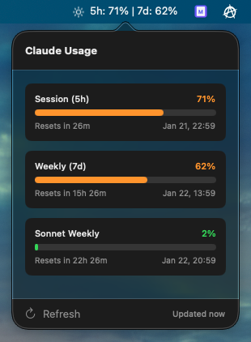

# Claude Usage

A macOS menu bar app that displays your Claude AI usage limits from claude.ai Pro/Max subscription.

## Features

- **Menu Bar Display**: Shows 5h session and 7d weekly usage percentages at a glance
- **Detailed Popover**: Click to see full usage breakdown with progress bars
- **Auto-refresh**: Updates every minute automatically
- **Color Coding**: Green/yellow/red indicators based on usage level
- **Right-click Menu**: Quick access to refresh and quit

## Screenshot



## Requirements

- macOS 15.0+ (Tahoe)
- Claude Code installed and logged in (for OAuth token in Keychain)
- Active Claude Pro/Max subscription

## Building

```bash
# Clone the repository
git clone https://github.com/yourusername/claude-ai-limits-widget.git
cd claude-ai-limits-widget

# Build with Swift Package Manager
swift build -c release

# Run the app
.build/release/ClaudeUsage
```

## Installation

After building, you can copy the executable to your Applications folder or run it from the command line.

To run on startup, add it to System Settings → General → Login Items.

## How It Works

The app reads the OAuth access token from the macOS Keychain that Claude Code stores when you log in. It then uses this token to call the Anthropic API to fetch your usage data.

**API Endpoint**: `https://api.anthropic.com/api/oauth/usage`

## Project Structure

```
ClaudeUsage/
├── App/
│   ├── ClaudeUsageApp.swift      # Main app entry point
│   └── AppDelegate.swift         # App lifecycle management
├── Core/
│   ├── UsageModels.swift         # Data models
│   ├── KeychainHelper.swift      # Keychain access
│   └── UsageService.swift        # API service
├── Features/
│   └── MenuBar/
│       ├── StatusBarController.swift  # Menu bar controller
│       └── UsagePopoverView.swift     # SwiftUI popover view
└── Resources/
    └── Assets.xcassets           # App assets
```

## Limitations

1. **Unofficial API** - The usage endpoint may change without notice
2. **Requires Claude Code** - Token is stored by Claude Code app
3. **Token refresh** - May need to handle token expiration

## Security

- Token is read-only from Keychain
- Only accesses usage data, no write operations
- No credentials stored by the app itself
- All requests to official Anthropic API

## License

MIT License
